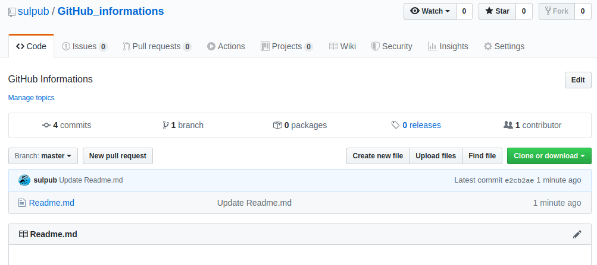

# GitHub informations

## Formating
Help for formating documentation
Link : https://help.github.com/en/categories/writing-on-github#task-lists

My usual commands :
# The largest heading
## The second largest heading
###### The smallest heading

# Basic formating
Link : https://help.github.com/en/articles/basic-writing-and-formatting-syntax


# Git commands


## Initialize a deposit

For initialize a deposit, send this command in a psecific directory :
```
git init.
```

## ADD a file in your repository
For adding a file, create a file in your local working directory. After this, send this command for add this file in the roepository :
```
git add Your_file_name
git commit
```

## Clone project

Open in your web browser the project in github that you want to clone.

Copy and paste the link.




To clone project set this command in a specific directory in your computer :
```
git clone copy_paste_link.git
```
## Upload an existing project

When you have finish the modifictaion of your file, you must do theses points
 1. Add on stage
 2. Commit the stage on on local commit
 3. Push the modification on the external server (github)

The command list to do this is :
```
git add file_with_modification 
git commit -m "add informations on the commit"
git push 
```

## Commit a project

After made some program modification or creating some file, you can commit your modifications by sending this command :

```
git commit -m “Information concernig you modification for explanation”    
```
Note : For each commit it's really important to explain yours modifications.

## PUSH the update to the server

To send your modification on the external repository, send this command :
```
git push
```

## PULL for update your local repository

To receive the last external modification, send this command :
```
git pull
```

## SEE the status of the file
This command see you the status of you file :
```
git status
```

## Make a delivery file (STASH)
To make a temporary saving file after some accidently modification, you can send this command:
```
git stash
```
with this command you backup temporary your modification and you recover your original file after modification.

You ca see these saving temprorary file by using this command :
```
git stash list
```

After that you can create a branch, enter in this branch and send this command to recover your modifications on the 
stash backup :
```
git stash apply
```

if you made a lot of stash bachup and you want recover a specific stash, after sending the "git stash list", you can  recover with this command :
```
git stash apply stash@{0}
```

## Change the message of the last commit
You can change the message on the last commit if you make somes misstakes with this command :
```
git commit --amend -m "Your new message of the last commit"
```

## Deposit a forgotten file in the last commit
If you forget files on your last commit, you can add these file with these commands :
```
git add Your_forgotten_file
git commit --amend --no-edit
```

## CRITICAL ERROR on your last commit
If you push a corrupted file on the public server, you have one possibility for correct the problem with doing this command
```
git revert HEAD^
```
IMPORTANT : With this command you correct you mistake, but you can lose local file if you don't make a backup.

NOTA : ***git reset HEAD*** cancel the change not committed.


## GIT RESET
There are tree git reset (soft, medium and hard)

The ***reset soft*** put a commit issue of the specific commit when you make some mistake. You don't lose file and the HEAD is not detach.
```
git reset --Soft 
```

The ***reset mixed*** put a commit of the the second last commit or a specific commit. This commit don't modify your current local file. No file wil be delete. But you detach the HEAD.
```
git reset --mixed 
```

The ***reset hard*** should be used with very attention. with this command, the history will be erase after your specific commit that you want tu reset.All the commit and branch associated with this commit will be delete. 
```
git reset specific_commit --hard 
```

## Branch

To know information concerning the branch, set this command :
```
git branch
```

For create a branch set this command :
```
git branch branch_name
```

If you accidently create a new brand and you want to delete it, you can send this command.
DELETE a branch :
```
git branch -d Your_branch_name_you_want_to_delete
```

For forcing the branch delete, you can set this command.
***Important: when you use -D, you force the erasement of the file and all history information for this branch.***

```
git branch -D Your_branch_name_you_want_to_force_delete
```

You can control the creation of your branch with sending this command.
The star set your position in the repository
```
git branch
```

For enter in the new branch send this command.
```
git checkout your_branch_name
```
You are now in your virtualy branch. To see the changing branch send the git branch and see that the star is positioning in your new branch.
